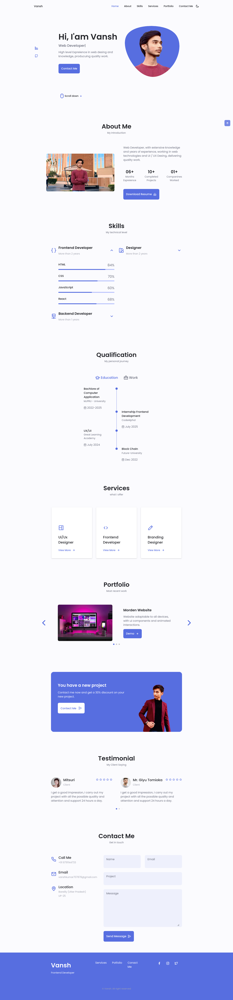

# 🌐 Responsive Portfolio Website

A fully responsive, clean, and modern **developer portfolio** website — perfect for showcasing your work, skills, and contact information. Built using **HTML, CSS, and JavaScript**, this template is beginner-friendly and easy to customize.

---

## 📍 Live Demo

🔗 [Visit My Portfolio](http://portfolio.uca.icu)  
---

## 🚀 Features

- ✅ Fully responsive design for all screen sizes
- 🌙 Clean UI/UX with smooth scrolling
- 🧩 About Me and Skills section
- 🛠️ Projects showcase with links
- 📩 Contact form or contact details
- 🖼️ Easy image and text customization
- 💻 Simple to deploy via GitHub Pages

---

## 🛠️ Built With

- HTML5  
- CSS3  
- JavaScript

---

## 📸 Screenshots

## 🙏 Acknowledgements

- Inspired by modern dev portfolio designs  
- Icons by [Font Awesome](https://fontawesome.com/)  
- Background images from [Unsplash](https://unsplash.com/) *(optional)*

---

## 📬 Contact

Feel free to connect:

- GitHub: [@Psychokiller70](https://github.com/Psychokiller70)  
- Email: `vanshkumar707878@gmail.com`  
- LinkedIn: [Vansh](https://www.linkedin.com/in/vansh-kumar-542bb326a/)

---

> 🚀 Keep building. Keep learning. Keep growing.
